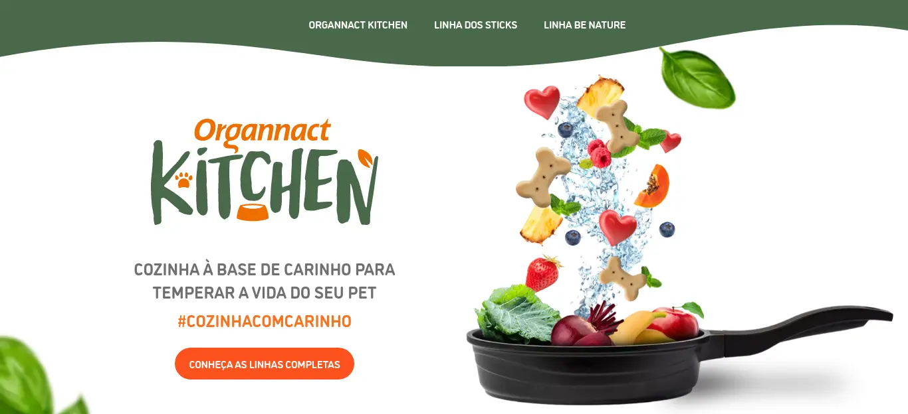
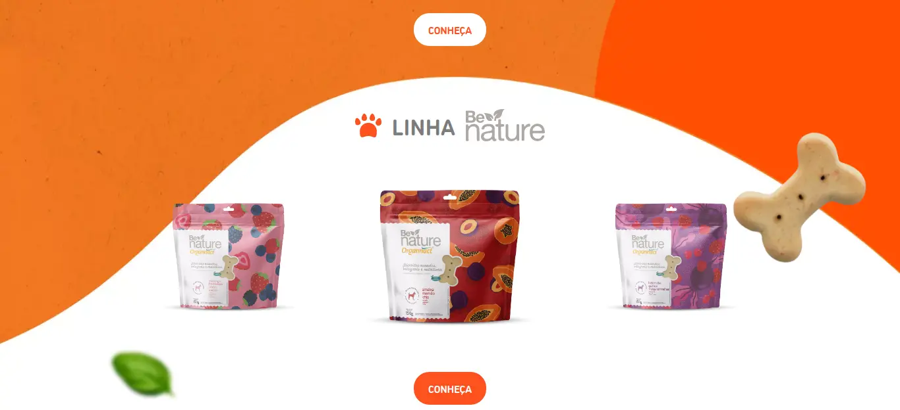
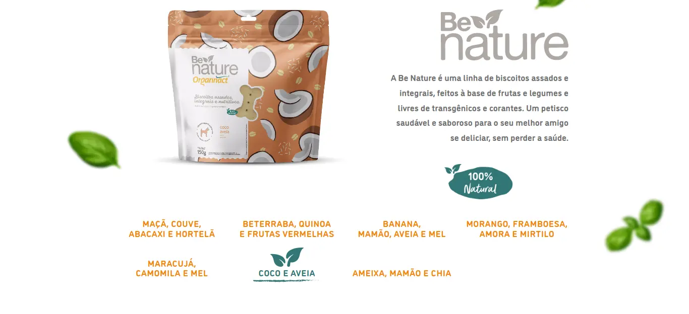

<h1 align="center">
    Landing Page interativa e bonitinha :smiling_face_with_three_hearts:
</h1>

<p align="center" id="objetivo">Desenvolvida com o objetivo de apresentar novos produtos aos usuários, de forma interativa e bem ilustrada.</p>

<h4 align="center" id="requisitos"> Pré-requisitos </h4>

<p align="center">Antes de começar, você vai precisar ter instalado em sua máquina as seguintes ferramentas:
[Git](https://git-scm.com), e um servidor local com Apache e PHP, para melhor navegação. </p>

<p align="center">
Além disto é bom ter um editor para trabalhar com o código como [VSCode](https://code.visualstudio.com/)
</p>

### :camera_flash: Layout

<div align="center" style="display: flex; align-items: flex-start; justify-content: center;">
   
   
   
   
   <a href="https://user-images.githubusercontent.com/47145180/214329525-f0a685b6-5e08-47c3-a588-75b1477ccc6a.mp4">
      Assista à captura de tela
   </a>

</div>

### 🛠 Tecnologias

As seguintes tecnologias foram usadas na construção do projeto:

- HTML
- CSS
- SCSS
- PHP
- Bootstrap
- JS

### 🎲 Rodando o projeto

```bash
# Clone este repositório para o seu ambiente web local
$ git clone <https://github.com/victormmoraes/cute-interactive-landing-page.git>
```
Acesse o servidor web local via navegador e caminhe até o local onde a pasta do projeto foi salva. Por exemplo: http://localhost/cute-interactive-landing-page

<h3 align="center"> 
	🚧 Em breve uma versão demo estará no ar... 🚀 🚧
</h3>

### 🦸 Autor

Feito com ❤️ por Victor Medrado 👋🏽 [Entre em contato!](https://www.linkedin.com/in/victormedrado/)

#### Todos os direitos reservados ao time de UX responsável pelo layout.
